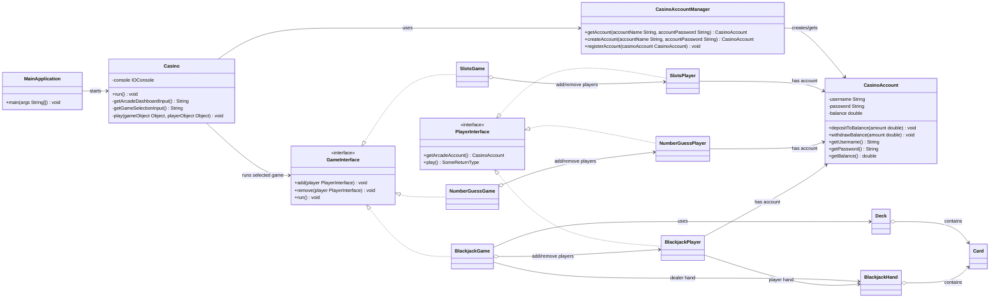

# GroupCasino UML (README-Aligned)

```mermaid
classDiagram
direction LR

class MainApplication {
  +main(args String[]) void
}

class Casino {
  -console IOConsole
  +run() void
  -getArcadeDashboardInput() String
  -getGameSelectionInput() String
  -play(gameObject Object, playerObject Object) void
}

class CasinoAccountManager {
  +getAccount(accountName String, accountPassword String) CasinoAccount
  +createAccount(accountName String, accountPassword String) CasinoAccount
  +registerAccount(casinoAccount CasinoAccount) void
}

class CasinoAccount {
  -username String
  -password String
  -balance double
  +depositToBalance(amount double) void
  +withdrawBalance(amount double) void
  +getUsername() String
  +getPassword() String
  +getBalance() double
}

class GameInterface {
  <<interface>>
  +add(player PlayerInterface) void
  +remove(player PlayerInterface) void
  +run() void
}

class PlayerInterface {
  <<interface>>
  +getArcadeAccount() CasinoAccount
  +play() SomeReturnType
}

class SlotsGame
class NumberGuessGame
class BlackjackGame

class SlotsPlayer
class NumberGuessPlayer
class BlackjackPlayer

class Deck
class Card
class BlackjackHand

MainApplication --> Casino : starts
Casino --> CasinoAccountManager : uses
Casino --> GameInterface : runs selected game
CasinoAccountManager --> CasinoAccount : creates/gets

GameInterface <|.. SlotsGame
GameInterface <|.. NumberGuessGame
GameInterface <|.. BlackjackGame

PlayerInterface <|.. SlotsPlayer
PlayerInterface <|.. NumberGuessPlayer
PlayerInterface <|.. BlackjackPlayer

SlotsGame o--> SlotsPlayer : add/remove players
NumberGuessGame o--> NumberGuessPlayer : add/remove players
BlackjackGame o--> BlackjackPlayer : add/remove players

SlotsPlayer --> CasinoAccount : has account
NumberGuessPlayer --> CasinoAccount : has account
BlackjackPlayer --> CasinoAccount : has account

BlackjackGame --> Deck : uses
BlackjackGame --> BlackjackHand : dealer hand
BlackjackPlayer --> BlackjackHand : player hand
Deck o--> Card : contains
BlackjackHand o--> Card : contains
```
